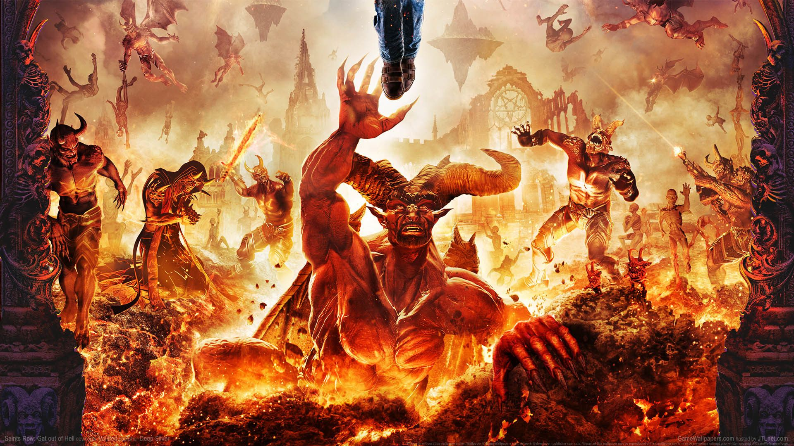
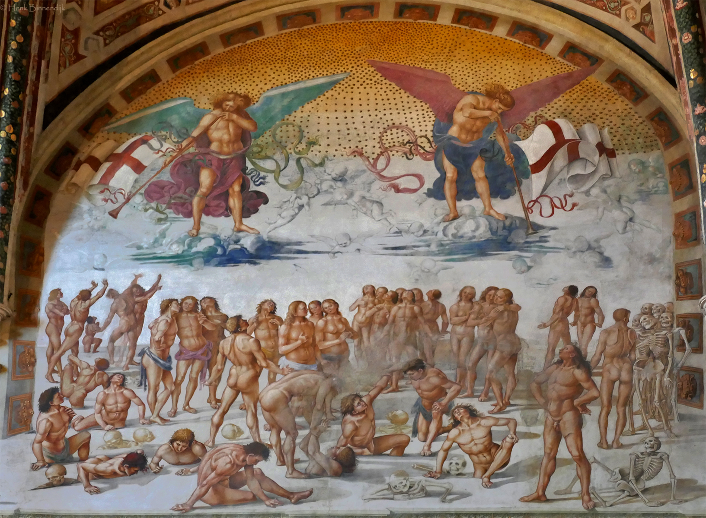
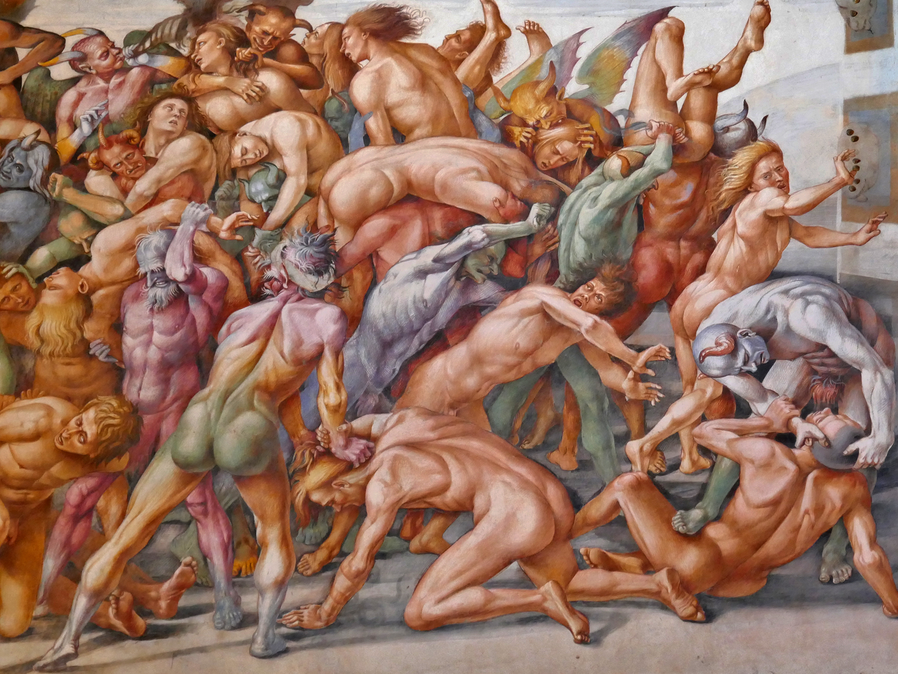
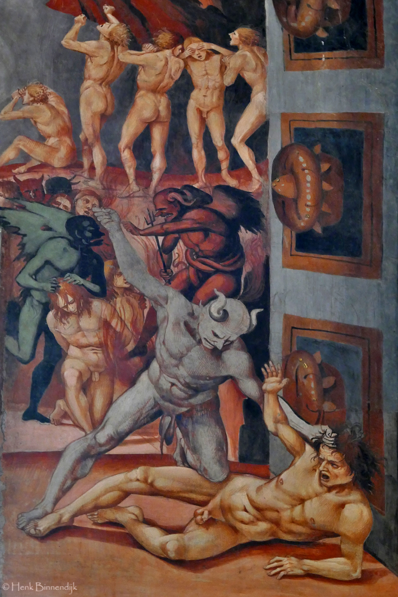
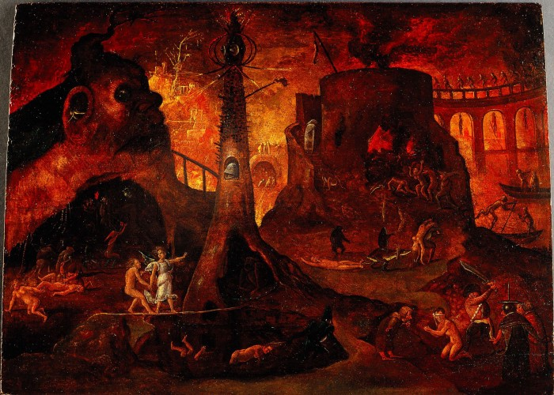
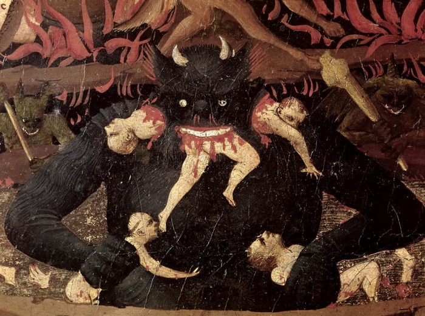
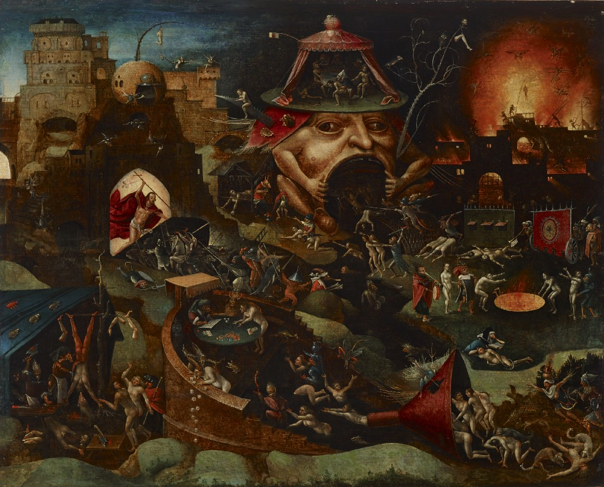
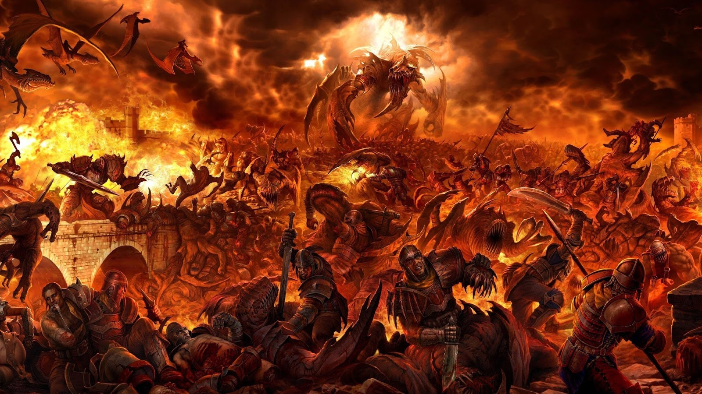
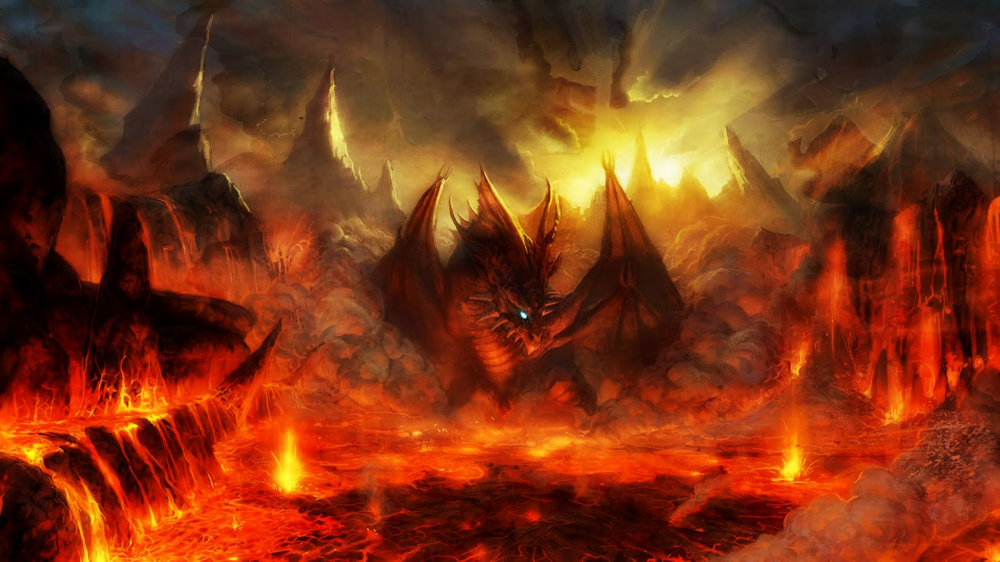

---
postNumber: 5
title: '3 Tingkatan Neraka Menurut Alkitab'
date: '2020-08-25'
tags:
  - life
  - rohani
---	

Dalam kehidupan ini setelah mengalami kematian didalam agama apapun hanya ada 2 tempat yang mengisahkan yang berbada. Yang pertama untuk orang-orang baik dan beriman dan yang kedua untuk orang-orang jahat dan tidak beriman. Dalam agama Kristen tempat ini dinamakan Surga dan Neraka. Orang yang hidupnya percaya kepada Yesus Kristus sebagai Tuhan dan Juru Selamat serta menaru imannya kepada Tuhan dan melakukan sesuatu sesuai kehendak-Nya akan memperoleh hidup yang kekal di Surga. Sedangkan orang yang hidupnya dipenuhi dengan kejahatan, tidak percaya kepada Yesus Kristus dan melakukan segala sesuatu yang jauh dari kehendak Tuhan maka ia akan hidup binasa di Nereka.

Apa yang Alkitab katakan tentang Neraka ? Dimanakah lokasinya ? Tempat seperti apakah neraka itu ?.
Pertama-tama harus kita ketahui bahwa Alkitab dituliskan dalam bahasa Ibrani dan Yunani oleh karena itu kita tidak bisa melewatkan pengertian Neraka dalam bahasa Ibrani dan Yunani. 
Ada 3 lokasi yang disebutkan dalam Alkitab menurut bahasa Ibrani dan Yunani.

## 1. Sheol/Hades 

Adalah tempat bagian dari Neraka yang paling atas atau sama dengan tempat penantian. Di dalam tempat penantian inipun banyak jiwa yang tidak luput dari pandangan utusan Neraka. 
Sheol, dalam bahasa Ibrani "Barzakh" merupakan kata yang merujuk kepada dunia orang mati, bahasa Inggrisnya diterjemahkan "Hell". Dalam perjanjian baru istilah "Hades" digunakan sebagai sebutan alam barzah. Dibeberapa bagian Alkitab perjanjian baru isitilah ini tampaknya bermakna suatu lingkungan yang netral, tempat orang-orang mati menanti-nantikan saatnya Yesus wafat, dimakamkan dan bangkit kembali. Ada 6 cara untk melihat kata Sheol digunakan dalam Perjanjian lama :

 - Sheol sebagai suatu tempat dimana tidak ada yang bisa melarikan diri atau menyelamatkan diri (Mazmur 89:48)
 - Sheol sebagai suatu tempat yang tidak memberikan harapan bagi yang telah mati untuk kembali menjadi hidup (Ayub 7:9)
 - Dalam Sheol tidak ada kegiatan yang dilakukan. Sheol adalah tempat yang hampa akan pengetahuan dan hikmat (Penghotba 9:10)
 - Kata Sheol digunakan untuk menggambarkan sebuah tempat bagi manusia setelah ia meninggal 
 - Sheol merujuk kepada nama tempat dimana orang-orang akan berada setelah meninggal
 - Kata Sheol juga menjadi suatu tempat yang menahan orang-orang benar, namun orang-orang tersebut akan ditebus Tuhan. (Ayub 21:13)

Semua orang mati pada masa perjanjian lama baik yang percaya maupun tidak percaya akan pergi ke tempat yang disebut sheol atau hades. Contohnya dalam kejadian 37:35, Ayub 14:13, Ayub 17:3, Mazmur 88:4, Yesaya 38:10. Untuk orang-orang fasik yang tidak percaya juga masuk ke Hades/Sheol dapat dilihat dari ayat-ayat didalam: Ayub 17:13, Mazmur 31:8, Mazmur 49:15.

Sheol atau Hades dapat diartikan bukanlah Surga dan juga Neraka, tetapi tempat penampungan sementara orang-orang yang telah meninggal. Lokasi Sheol berada pada pusat Bumi (Bilangan 16:33, Efesus 4:9)

## 2. Gehanna/Neraka

Adalah tempat atau bagian tengah dari Neraka. Siksaan dibagian ini lebih kejam daripada di Hades. Gehanna adalah sebuah konsep dalam agama Yahudi yang jika diterjemahkan kedalam bahasa Indonesia adalah Neraka atau Jahanam. Dalam alkitab sendiri Gehanna memiliki pengertian sebagai berikut:   

 - Neraka sebuah tempat terpisah dari Tuhan. Gambaran Neraka menurut Kristen di hari penghakiman Yesus akan bersabda untuk semua orang yang tidak melakukan pertobatan dan tidak percaya (Matius 25:41)
 - Neraka tempat setan dan malaikat pemberontak. Yesus bersabda jika api Neraka yang kekal sudah dipersiapkan untuk para iblis dan juga para malaikat yang membangkang dan juga penghukuman. Manusia diciptakan untuk Tuhan sementara Neraka diciptakan untuk setan beserta pengikutnya. Akan tetapi manusia yang penuh dengan dosa dan tidak percaya dengan Yesus sebagai Juru Selamat juga akan menjalani kehidupan abadi di Neraka bersama setan.
 - Neraka bersifat kekal. Kata Yunani untuk "kekal" adalah Aignios. Neraka merupakan tempat pembuangan dan hukuman kekal bagi iblis dan malaikat-malaikat pengikutnya yang bergabung dalam pemberontak terhadap Tuhan di Surga. 

Kengerian dan keberadaan Neraka ini dijelaskan oleh Alkitab sebagai berikut:

 1. Dineraka akan ada kesadaran dan ingatan (Lukas 16:19-21)
 2. Bagian terburuk dari Neraka adalah bahwa disana akan ada siksaan dan penderitaan (Lukas 16:24, Lukas 16:28, Wahyu 14:10-11)
 3. Adanya ulat (belatung) yang tidak akan mati dan api yang tak terpadamkan (Matius 13:41-42, Markus 9:47-48)
 4. Dineraka akan ada kesengsaraan, amarah, dan frustasi (Matius 13:41-42)
 5. Alkitab mengarjarkan adanya tingkat-tingkat hukuman dineraka berdasarkan banyaknya dosa, sifat dosa dan penolakan yang dilakukan terhadap Tuhan dan Karya-Nya (Matius 10:15) 

Siapakah yang akan masuk ke Neraka atau Gehanna ?
 1. Binatang dan Nabi palsu (Wahyu 19:20)
 2. Iblis (Wahyu 20:10)
 3. Maut dan kerajaan maut (Wahyu 20:14)
 4. Orang-orang fasik (Wahyu 21:8)

## 3. Jurang Yang Tak Berdasar

Adalah bagian Neraka yang paling dalam. Ditempat ini terdapat lautan api dan belerang dimana para jiwa yang berdosa direndam dalam lautan itu. Ditempat ini pula Allah memenjarahkan Si Naga atau Iblis yang akan dilepaskan pada masa tujuh tahun penderitaan.

Itulah 3 tingkatan Neraka yang ada di Alkitab. Sangat mengerikan bukan ? Untuk itu marilah kita bersungguh-sungguh mengikut Tuhan Yesus, Percaya Kepada Dia dan hidup sesuai Kehendaknya. Mintalah bimbingan Roh Kudus dalam hidupmu. 
