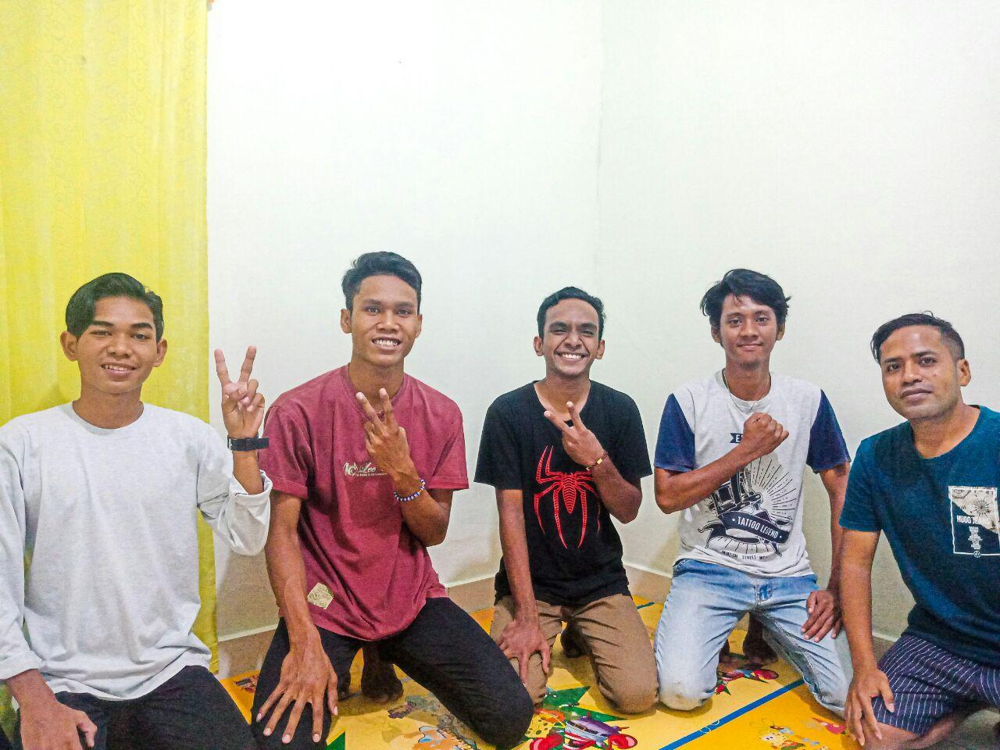
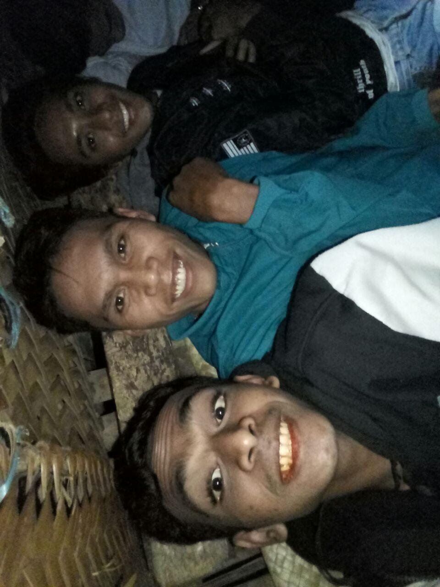
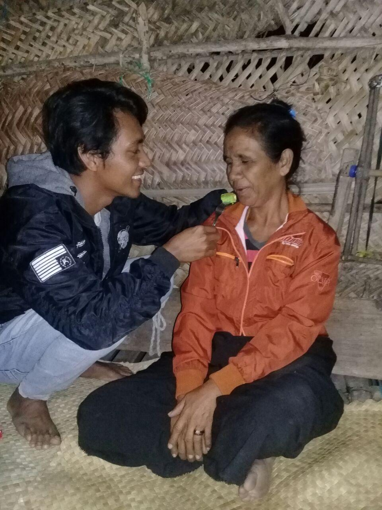

---
postNumber: 4
title: 'Kanatang Remix'
date: '2020-08-05'
tags:
  - life
---	

Jumat 24 Juli 2020 pada sore hari saya dan brader-brader saya melaksanakan kegiatan KTB(Kelompok Tumbuh Bersama) kami. KTB kali ini diikuti oleh 3 orang brader saya (Dede, Aner, Rafael) yang dipimpin oleh kaka KTB kami kak Stenly. Tidak seperti biasanya kami melakukan KTB di sore hari, biasanya kami rutin Ber-KTB di pagi hari hari, hal ini dikarenakan kegeoisan saya yang meminta waktu Ber-KTB diundur hingga sore hari. Setelah Ber-KTB saya pun diajak oleh Rafael untuk pergi kerumahnya di Kanatang, dalam hati saya sedikit terkejut, "Mari pergi di sam rumah" kalimat Rafael yang hendak mengajak saya untuk pergi kerumahnya. Saya pun menerima ajakan brader saya tersebut tanpa saya mengetahui maksud dan tujuan apa yang membuat Rafael mengajak saya kerumahnya.

Sesampainya di Kanatang kami mengunjungi rumah kakanya terlebih dahulu, seperti biasa jikalau teman datang berkunjung pasti selalu merepotkan tuan rumah :D, beberapa menit kemudian saat kami bersandar di kursi kopi pun datang dan disuguhi oleh brader Rafael yang diikuti dengan cemilan enak. Dede adalah orang pertama yang meresponi ketika Rafael hendak membawakan kopi, dengan suaranya yang tegas dia berkata "Yah kenapa repot-repot bikin minum lagi" omongannya tersebut diikuti dengan gerakan tangannya yang mendahului kami semua mengambil kopi dan meminum, sontak suasana pun menjadi penuh canda tawa akan tingkah laku lelucon dede. Setelah beberapa lama kemudian kami melanjutkan perjalanan menuju ke rumah orang tua Rafael ynag berada di Pesisiran Pantai Kanatang. 

Atsmosfer tempat persinggahan kali ini sedikit berbeda, saat saya dan brader saya sampai kami disugihi dengan sirih pinang oleh tuan rumah yang merupakan mama dari Rafael. Udara di tempat ini sangat dingin, membuat saya harus menggunakan kembali jaket yang saya genggam di tangan. Sambil bercerita dengan ibunda Rafael mulut saya pun tak henti-henti mengunyah sirih pinang. Disaat itu juga brader saya yang lainnya terkejut mengetahui kalau saya bisa makan sirih pinang :D, yah saya sudah makan sirih pinang sejak kecil dulu, itupun awal-awalnya suku pusing ketika makan sirih pinang.

Beberapa lama kemudian saat kami sedang asik bercerita tiba-tiba Rafael diberitahukan oleh saudaranya dirumah bahwa mereka sedang merayakan hari ulang tahun Ibunya dan Adik laki-lakinya. Dengan muka polosnya pun Rafael sama sekali tidak mengetahui akan hal ini, bahkan ia tidak mengingat hari ulang tahun ibunya saat saya bertanya kepada dia. Sesudah itu saya diajak oleh Rafael untuk mengambil kue ulang tahun yang tidak jauh dari rumahnya. 

Senang rasanya dapat turut hadir bersama-sama diantara keluarga Rafael merayakan ulang tahun Ibundanya dan Adiknya. Terima Kasih Tuhan untuk kasih setia-Mu yang tak pernah berkesudahan dalam hidupku.

