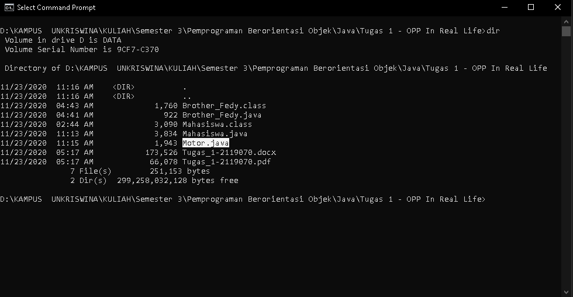
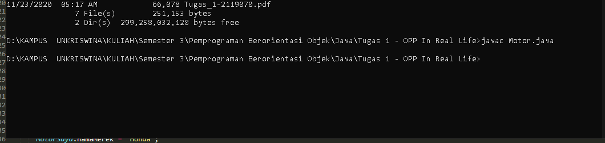
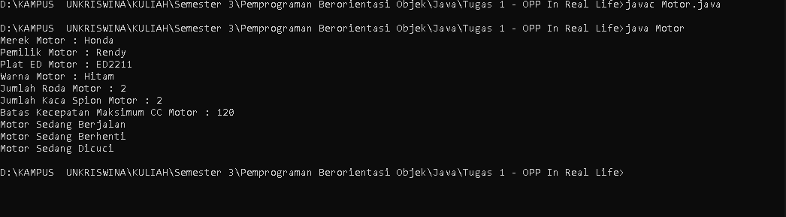

---
postNumber: 6
title: 'Membuat Program OOP JAVA - Motor'
date: '2020-11-23'
tags:
  - programming
  - tutorial
  - java
---	

#Syalomm
Syalom Selamat Datang Dan Selamat Belajar.

Pada Postingan Kali Ini Kita Akan Bersama-sama Membuat Program Sederhana Menggunakan Bahasa Pemprograman JAVA Dengan Pendekatan OOP (Object Orientent Programming).
Fenomena Dikehidupan Nyata Yang Kita Ambil Untuk Dituangkan Kedalam Bentuk Program Dengan Pendekatan OOP Yaitu Motor. Motor Memiliki Properti/Atribut Atau Alat-Alat Yang Menyatuh Dengannya Yaitu:
  1. Nama Merek
  2. Nama Pemilik
  3. Plat ED
  4. Warna Motor
  5. Jumlah Roda
  6. Jumlah Kaca Spion
  7. Batas Kecepatan Maksimum CC


Dalam Kehidupan Nyata, Motor Dapat Melakukan Beberapa Hal Atau Aksi Yang Nantinya Akan Menjadi Method Pada Class Motor Seperti:
  1. Berjalan
  2. Berhenti
  3. Dicuci

Nah Dari Data-Data Atau Fenomena Tersebut Kita Akan Membuat Sebuah Program Motor Yang Memiliki Properti dan Method Seperti Yang Telah Dijabarkan Diatas.

Langkah-Langkah:
#1. Membuat Stuktur Program
``` java
public class Motor {
	// Properti Pada Class Motor

	// Method Pada Class Motor 	

	public static void main(String[] args) {

	}
} 
``` 

#2. Menambahkan Properti Pada Class Motor
``` java
	// Properti Pada Class Motor
	String namaMerek, namaPemilik, platED, warnaMotor;
	int jumlahRoda, jumlahKacaSpion, batasKecepataMaksimulCC;
``` 

#3. Menambahkan Method Pada Class Motor
``` java
	// Method Pada Class Motor 	
	// Method Saat Motor Berjalan
	void berjalan() {
		System.out.println("Motor Sedang Berjalan");
	}

	// Method Saat Motor Berhenti
	void berhenti() {
		System.out.println("Motor Sedang Berhenti");
	}

	// Method Saat Motor Sedang Dicuci
	void diCuci() {
		System.out.println("Motor Sedang Dicuci");
	}
``` 

Saat Ini Baris Kode Kita Seperti Ini:
``` java
public class Motor {
	// Properti Pada Class Motor
	String namaMerek, namaPemilik, platED, warnaMotor;
	int jumlahRoda, jumlahKacaSpion, batasKecepataMaksimulCC;
	
	// Method Pada Class Motor 	
	// Method Saat Motor Berjalan
	void berjalan() {
		System.out.println("Motor Sedang Berjalan");
	}

	// Method Saat Motor Berhenti
	void berhenti() {
		System.out.println("Motor Sedang Berhenti");
	}

	// Method Saat Motor Sedang Dicuci
	void diCuci() {
		System.out.println("Motor Sedang Dicuci");
	}

	public static void main(String[] args) {

	}
} 
``` 

#4. Menginisialisasi Objek Baru Menggunakan Class Motor 
``` java
	// Menginisialisasi Objek MotorSaya Menggunakan Class Motor 
	Motor MotorSaya = new Motor();

``` 
Pada Kode Diatas Kita Menginisialisasi Objek MotorSaya Dengan Menggunakan Class Motor.

#5. Memberikan Nilai Properti Pada Objek
``` java
	// Memberikan Nilai Properti Pada Objek MotorSaya
	MotorSaya.namaMerek = "Honda";
	MotorSaya.namaPemilik = "Rendy";
	MotorSaya.platED = "ED2211";
	MotorSaya.warnaMotor = "Hitam";
	MotorSaya.jumlahRoda = 2;
	MotorSaya.jumlahKacaSpion = 2;
	MotorSaya.batasKecepataMaksimulCC = 120;
```

#6. Menampilkan Seluruh Properti Yang Dimiliki Objek
``` java
	// Menampilkan Seluruh Properti Yang Dimiliki Objek Rendy
	System.out.println("Merek Motor : " + MotorSaya.namaMerek);
	System.out.println("Pemilik Motor : " + MotorSaya.namaPemilik);
	System.out.println("Plat ED Motor : " + MotorSaya.platED);
	System.out.println("Warna Motor : " + MotorSaya.warnaMotor);
	System.out.println("Jumlah Roda Motor : " + MotorSaya.jumlahRoda);
	System.out.println("Jumlah Kaca Spion Motor : " + MotorSaya.jumlahKacaSpion);
	System.out.println("Batas Kecepatan Maksimum CC Motor : " + MotorSaya.batasKecepataMaksimulCC);
```

Sampai Disini Jika Teman-Teman Mengikuti Dengan Seksama Langkah-Langkah Yang Ada Maka Kode Teman-Teman Akan Seperti Ini :
``` java
public class Motor {
	// Properti Pada Class Motor
	String namaMerek, namaPemilik, platED, warnaMotor;
	int jumlahRoda, jumlahKacaSpion, batasKecepataMaksimulCC;
	
	// Method Pada Class Motor 	
	// Method Saat Motor Berjalan
	void berjalan() {
		System.out.println("Motor Sedang Berjalan");
	}

	// Method Saat Motor Berhenti
	void berhenti() {
		System.out.println("Motor Sedang Berhenti");
	}

	// Method Saat Motor Sedang Dicuci
	void diCuci() {
		System.out.println("Motor Sedang Dicuci");
	}
	
	public static void main(String[] args) {
		// Menginisialisasi Objek MotorSaya Menggunakan Class Motor 
		Motor MotorSaya = new Motor();

		// Memberikan Nilai Properti Pada Objek MotorSaya
		MotorSaya.namaMerek = "Honda";
		MotorSaya.namaPemilik = "Rendy";
		MotorSaya.platED = "ED2211";
		MotorSaya.warnaMotor = "Hitam";
		MotorSaya.jumlahRoda = 2;
		MotorSaya.jumlahKacaSpion = 2;
		MotorSaya.batasKecepataMaksimulCC = 120;
	
		// Menampilkan Seluruh Properti Yang Dimiliki Objek Rendy
		System.out.println("Merek Motor : " + MotorSaya.namaMerek);
		System.out.println("Pemilik Motor : " + MotorSaya.namaPemilik);
		System.out.println("Plat ED Motor : " + MotorSaya.platED);
		System.out.println("Warna Motor : " + MotorSaya.warnaMotor);
		System.out.println("Jumlah Roda Motor : " + MotorSaya.jumlahRoda);
		System.out.println("Jumlah Kaca Spion Motor : " + MotorSaya.jumlahKacaSpion);
		System.out.println("Batas Kecepatan Maksimum CC Motor : " + MotorSaya.batasKecepataMaksimulCC);
	}
} 
```

#7. Memanggil Method Yang Ada Pada Objek
``` java
	// Memanggil Method Yang Dimiliki Objek MotorSaya
	// Motor Sedang Berjalan
	MotorSaya.berjalan();

	// Motor Sedang Berhenti
	MotorSaya.berhenti();

	// Motor Sedang Dicuci
	MotorSaya.diCuci();
```		

Souce Code Fullnya Akan Menjadi Seperti Ini:
``` java
// Class Motor
public class Motor {
	// Properti Pada Class Motor
	String namaMerek, namaPemilik, platED, warnaMotor;
	int jumlahRoda, jumlahKacaSpion, batasKecepataMaksimulCC;

	// Method Pada Class Motor
	// Method Saat Motor Berjalan
	void berjalan() {
		System.out.println("Motor Sedang Berjalan");
	}

	// Method Saat Motor Berhenti
	void berhenti() {
		System.out.println("Motor Sedang Berhenti");
	}

	// Method Saat Motor Sedang Dicuci
	void diCuci() {
		System.out.println("Motor Sedang Dicuci");
	}

	public static void main(String[] args) {
		// Menginisialisasi Objek MotorSaya Menggunakan Class Motor 
		Motor MotorSaya = new Motor();

		// Memberikan Nilai Properti Pada Objek MotorSaya
		MotorSaya.namaMerek = "Honda";
		MotorSaya.namaPemilik = "Rendy";
		MotorSaya.platED = "ED2211";
		MotorSaya.warnaMotor = "Hitam";
		MotorSaya.jumlahRoda = 2;
		MotorSaya.jumlahKacaSpion = 2;
		MotorSaya.batasKecepataMaksimulCC = 120;

		// Menampilkan Seluruh Properti Yang Dimiliki Objek Rendy
		System.out.println("Merek Motor : " + MotorSaya.namaMerek);
		System.out.println("Pemilik Motor : " + MotorSaya.namaPemilik);
		System.out.println("Plat ED Motor : " + MotorSaya.platED);
		System.out.println("Warna Motor : " + MotorSaya.warnaMotor);
		System.out.println("Jumlah Roda Motor : " + MotorSaya.jumlahRoda);
		System.out.println("Jumlah Kaca Spion Motor : " + MotorSaya.jumlahKacaSpion);
		System.out.println("Batas Kecepatan Maksimum CC Motor : " + MotorSaya.batasKecepataMaksimulCC);

		// Memanggil Method Yang Dimiliki Objek MotorSaya
		// Motor Sedang Berjalan
		MotorSaya.berjalan();

		// Motor Sedang Berhenti
		MotorSaya.berhenti();

		// Motor Sedang Dicuci
		MotorSaya.diCuci();
	}
}
```

###Compile Program



###Hasil Program Setelah Dijalankan


Demikian Proses Pembuatan Program Sederhana Berdasarkan Fenomena Yang Ada Dikehidupan Nyata Dengan Pendekatan OOP Menggunakan Bahasa Pemprograman Java.
Sampai Jumpa Di Postingan Selanjutnya. GBU ALWAYS.


