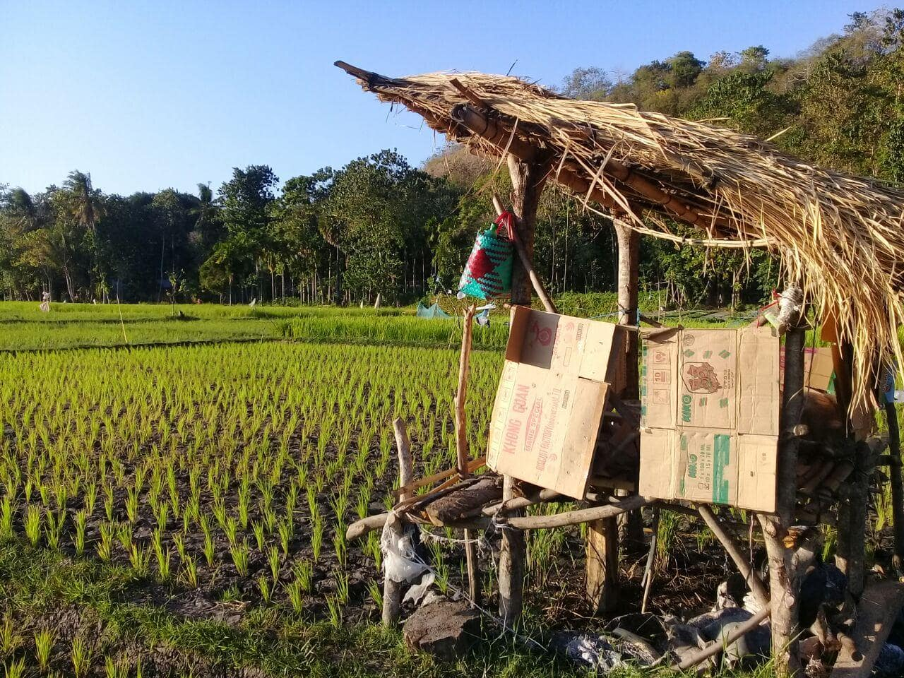
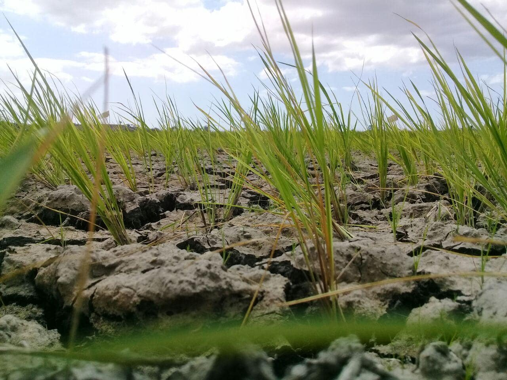
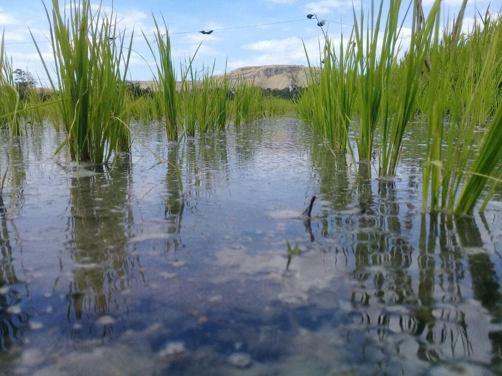

---
postNumber: 3
title: 'Mimpi Buruk Yang Hampir Terjadi'
date: '2020-07-29'
tags:
  - life
---	

Sabtu 18 juli 2020 merupakan hari yang penuh dengan kegembiraan dan pengharapan bagi ayah saya, hal ini dapat saya lihat dari raut wajahnya. Di libur sabtu ini kami melakukan penanaman padi di sawah kontrakan ayah saya. Proses penanaman padi ini dibantu oleh 4 orang sewaan yang diminta untuk membantu menanam padi, 2 orang tetangga rumah kami dan 2 orang yang merupakan warga di daerah sekitar sawah kontrakan kami. Ayah saya selalu bersemangat pada saat menanam padi, ia selalu tersenyum dengan penuh harapan agar pada yang ditanam ini dapat memenuhi kebutuhan hidup kami sekeluarga. 

4 Hari setelah penanaman padi tiba-tiba bendungan yang mengaliri air kesawah ditutupi, penutupan aliran air ini dilakukan untuk melakukan pembersihan selokan yang ada di bendungan dari lumpur yang bertumpukan. Ayah saya pun terkujut akan kejadian ini kerena sebelumnya tidak ada himbauan dari pihak bendungan terkait dengan penutupan aliran air. Ayah saya mulai merasa khawatir dan cemas karena takut jika sawah kami mengalami kekeringan mengingat kami baru saja menanam padi dan juga padi yang baru saja ditanam harus membutuhkan air cukup banyak.

Rasa kekhawatiran ayah saya semakinan membesar saat 5 hari air belum juga mengalir ke sawah, padahal kata petugas bendungan proses penutupan aliran air menghabiskan waktu selama 3 hari saja dan ini sudah lewat 2 hari. Saya juga merasa bersedih melihat kondisi sawah yang kekeringan air, padi-padi yang hijau itu kini menjadi kuning dan layu. Siang hari ketika saya membawakan makan siang untuk ayah saya, tidak seperti hari biasa perilakunya, yang kemarin-kemarin bersemangat dan tersenyum kini ia lebih banyak diam, walaupun ia tidak menunjukan kesedihannya kepada kita anak-anaknya agar kami juga tidak larut dalam kesedihan dan agar pikiran kami tetap fokus dengan studi dan pekerjaan kami.

Saya sedih jikalau kami harus gagal memanem padi kali ini, mengingat persediaan beras di rumah sudah menipis dan juga biaya yang dikeluarkan saat menanam padi tidaklah sedikit. Dalam kelarutan kesedihan yang saya alami, saya berdoa kepada Tuhan meminta pertolongan-Nya dan kuasa-Nya agar masalah yang terjadi saat ini dapat diberikan jalan keluarnya, memohon kepada Tuhan agar air dari bendungan dapat lagi mengalir kembali dan sawah tidak kering lagi sehingga kami tidak terancam gagal panen lagi di musim kemarau ini.

Puji Tuhan di hari yang ke 6 setelah air selokan dari bendungan ditutupi, Tuhan menjawab doa saya dan memberikan jalan keluar dari permasalahan yang sedang terjadi,  kini dari pihak bendungan sudah membukanya kembali, air pun mengalir begitu deras dan jernih. Sawah kami tidak lagi terancam dari kekeringan. Rawut wajah ayah saya pun kembali berseri-seri. Kini tugas selanjutnya yang harus dilakukan di sawah adalah menjaga burung.

### Terima Kasih Tuhan.
